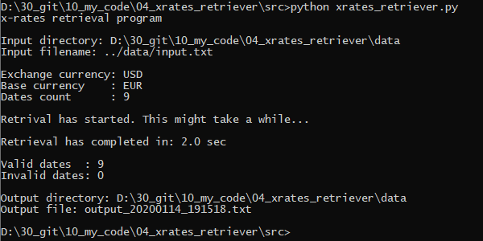
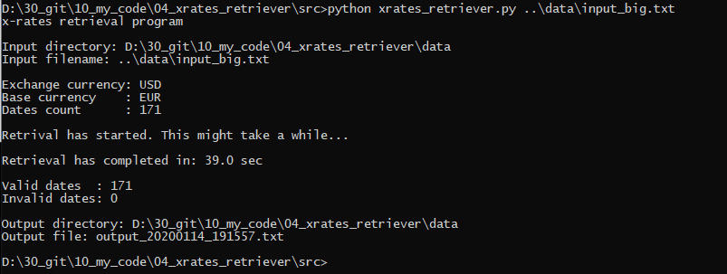
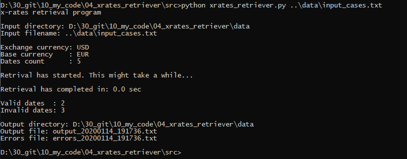
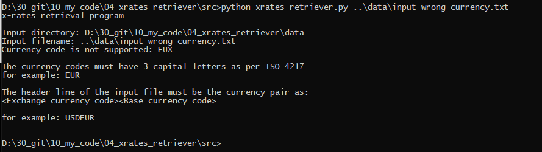

# xrates retriever

## Description
Exchange Rates Retriever fetches historical exchange rates for any day since 1999 for all currencies including cryptocurencies. It is simple in use 

## Features
- It supports all currencies including cryptocurrencies.
- It can retrieve historical exchange rates for any day since 1999.
- It retrieves mutliple exchange rates for multiple dates in one go.
- The base currency is variable.
- The user can just fill-in the data in the default input file input.txt.

## Installation
- Clone the repository using `git clone https://github.com/thanosa/xrates-retriever.git` 
- Install Python 3.X
- Install forex-python with `pip install forex-python` 
More details about forex-python:
https://forex-python.readthedocs.io/en/latest/usage.html

## Usage
### Default input file
1. Fill-in the currency pair and the historical dates as in: data\input.txt
2. Execute the application without specifing (input_file_path) (check below)
3. Receive the output from the data\output_(timestamp).txt

### Custom input file
1. Create a new input file as described in: data\input_template.txt
2. Execute the application giving the (input_file_path) as 1st argument (check below)
3. Receive the output from the data\output_(timestamp).txt

### Execution under Linux
- If python is in $PATH variable, execute:
`python xrates_retriever.py (input_file_path)`

example for the default input file
`python xrates_retriever.py`

example for the custom input file
`python xrates_retriever.py data/my_input.txt`

- If python is not in $PATH variable, execute:
`/path/to/python src/xrates_retriever.py (input_file_path)`

example for the default input file
`/path/to/python xrates_retriever.py`

example for the custom input file
`/path/to/python xrates_retriever.py data/my_input.txt`

### Execution under Windows
- If python is in %PATH% variable, execute: 
`python xrates_retriever.py (input_file_path)`

example for the default input file
`python xrates_retriever.py`

example for the custom input file
`python xrates_retriever.py data\my_input.txt`

- If python.exe is not in %PATH% variable, execute:
`/path/to/python.exe src/xrates_retriever.py (input_file_path)`

example for the default input file
`/path/to/python.exe xrates_retriever.py`

example for the custom input file
`/path/to/python.exe xrates_retriever.py data\my_input.txt`

## Tests
This is a test in which the default input file is used so there is file argument provided.
There are 9 valid dates that are processed for which the exchange rates are written in the output_20200114_191518.txt

This is a test in which a custom input file is processed.
171 valid historical dates that are retrieved for the USD currency based on EUR.

This is a test in which the custom input_cases.txt input file is processed.
There are 2 valid dates for which the exchange rates are written in the output_20200114_191736.txt
and 3 invalid dates for which "na" is written in the errors_20200114_191736.txt

This is a test in which a wrong currency code has been provided.
The user is informed about the correct date format.
In this case there is no output file produced.

## Contribute
Pull requests, bug reports, and feature requests are welcome.

## License
This software is under MIT licence.